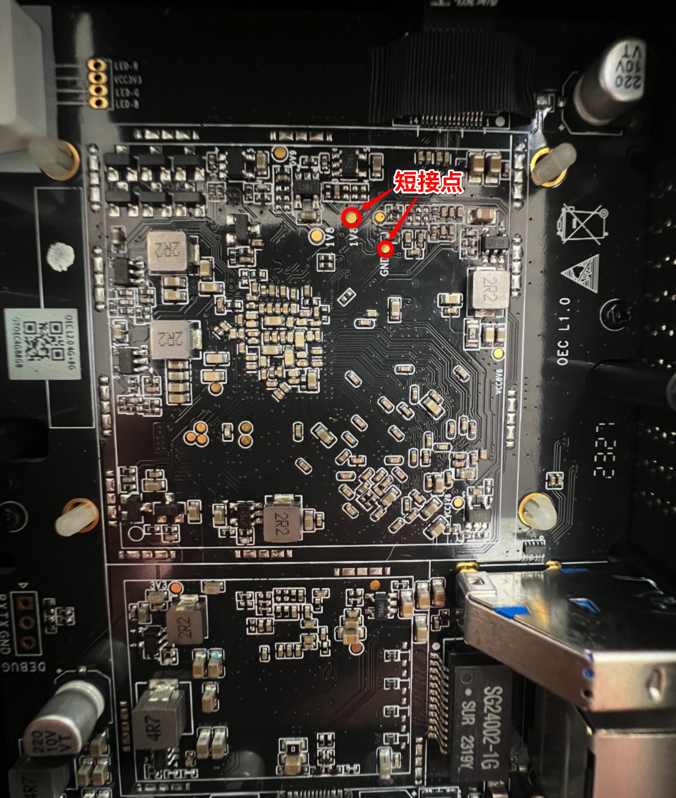
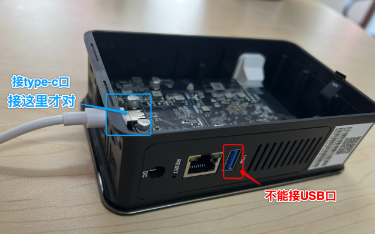
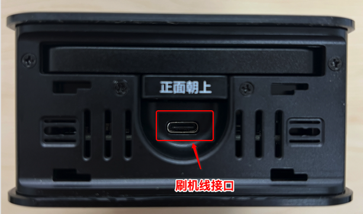
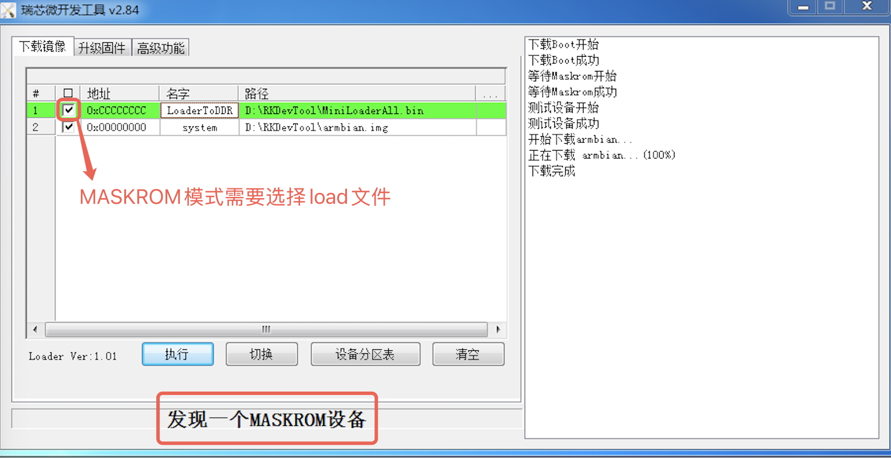
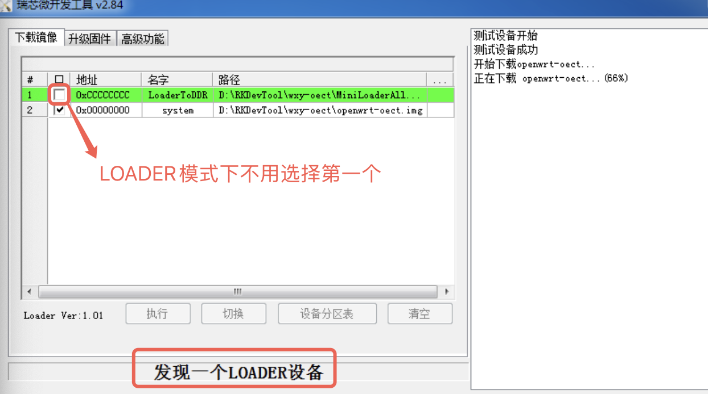
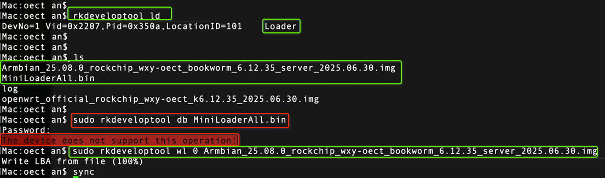
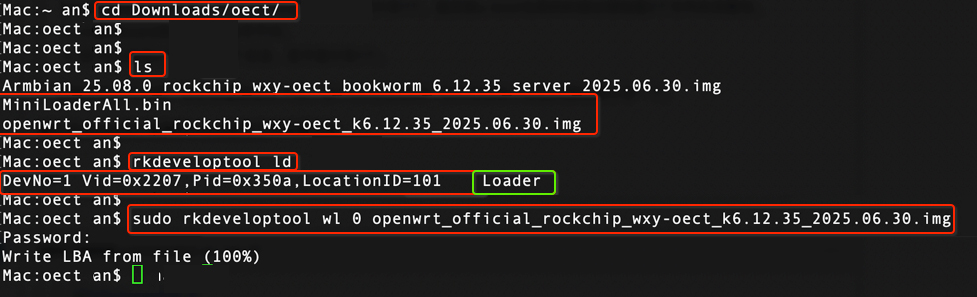
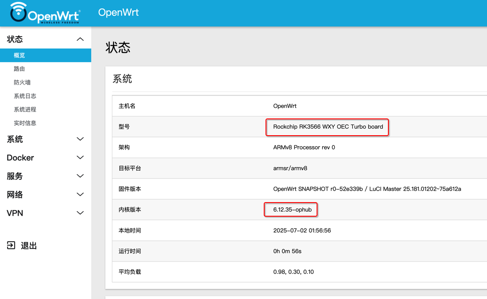
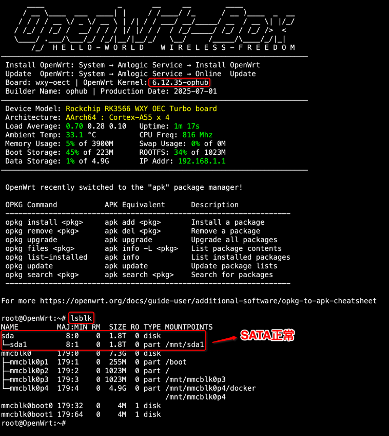

# ImmortalWrt OEC-turbo 自动构建

这个仓库用于基于官方 ImmortalWrt ImageBuilder 自动构建 OEC-turbo 方向的固件，并通过 GitHub Actions 定期发布到 Releases。

当前目标是先把构建链跑通，保持镜像尽量接近官方；常用包和旁路由自用配置都拆成独立变体，后续扩展时不会污染官方精简底包。

## 重要状态

我参考了 [ophub/amlogic-s9xxx-armbian#2736](https://github.com/ophub/amlogic-s9xxx-armbian/pull/2736)、[ImmortalWrt 官方源码](https://github.com/immortalwrt/immortalwrt) 和官方下载站目录。

截至当前检查，ImmortalWrt 官方 `rockchip/armv8` 的 release 与 snapshot `profiles.json` 里都还没有 `wxy-oec`、`wxy-oect`、`oec-turbo` 这类 profile。也就是说，当前 workflow 已经支持“官方 ImageBuilder 构建多变体”，但真正的 OEC-turbo 官方精简包需要满足其中一个条件：

- ImmortalWrt 官方后续合入 OEC-turbo profile，然后把 `config/build.env` 里的 `IMMORTALWRT_PROFILE` 改成真实 profile。
- 本仓库后续转入源码构建，携带 OEC-turbo 的 DTS、profile、u-boot/loader 相关补丁。

目前默认 profile 是 `friendlyarm_nanopi-r3s`，只是一个已存在的 RK3566 官方 profile，占位用于验证第一波构建流程。

## Release 变体

同一次 workflow 会把多个固件变体发布到同一个 Release，文件名前缀区分用途。

| 文件名 | 说明 | rootfs 分区 | 叠加内容 |
| --- | --- | --- | --- |
| 无特殊后缀 | 官方精简包 | 300 MiB | 只使用官方 profile 和 `packages/base.txt`，默认不加包 |
| `*-plus.*` | 常用依赖包 | 2048 MiB | 在标准包基础上追加 `packages/plus.txt` 和手动输入的 `extra_packages` |
| `*-bypass.*` | 自用旁路由包 | 4096 MiB | 在 `plus` 基础上追加 `packages/bypass.txt`，并写入 `files/bypass` 下的首启旁路由配置 |

`*-bypass.*` 是我自己的旁路由启动配置包，默认网络会被改成 `10.11.11.3/24`，不适合其他人的普通刷机环境。其他人请使用无特殊后缀的基础包或 `*-plus.*` 包。

当前 `packages/plus.txt` 已内置 Argon 主题、Argon 配置页、网络唤醒和 OpenVPN Server。后续继续追加常用依赖包时仍放到 `packages/plus.txt`；只属于旁路由模式的包放到 `packages/bypass.txt`。

当前常用依赖包：

- `luci-theme-argon`
- `luci-app-argon-config`
- `luci-app-wol`
- `luci-app-openvpn-server`

ImmortalWrt 25.12 使用 `apk` 包管理器构建 rootfs。当前官方包里 `luci-app-openvpn-server` 与依赖包 `openvpn-openssl` 都包含 `/etc/config/openvpn`，ImageBuilder 默认会因为同名文件归属冲突中止。workflow 检测到包列表包含 `luci-app-openvpn-server` 时，会对本次 ImageBuilder 的 `apk add` 调用加上 `--force-overwrite`，让 OpenVPN Server 的配置文件覆盖默认配置；这个补丁只作用在当前构建目录，不会修改上游源码。

## 当前默认配置

默认值在 [config/build.env](config/build.env)：

```ini
IMMORTALWRT_TARGET=rockchip/armv8
IMMORTALWRT_PROFILE=friendlyarm_nanopi-r3s
IMMORTALWRT_FILESYSTEM=squashfs
IMMORTALWRT_VARIANTS="base plus bypass"
IMMORTALWRT_BASE_ROOTFS_PARTSIZE=300
IMMORTALWRT_PLUS_ROOTFS_PARTSIZE=2048
IMMORTALWRT_BYPASS_ROOTFS_PARTSIZE=4096
```

定时任务：每周五 `01:20 UTC`，约等于北京时间周五 `09:20`。

## 默认登录信息

标准包和 `*-plus.*` 包保持官方默认网络和默认密码，不写入自定义首启密码脚本。

| 固件 | 默认管理地址 | 用户名 | 默认密码 |
| --- | --- | --- | --- |
| 无特殊后缀基础包 | `http://192.168.1.1/` | `root` | 空密码 |
| `*-plus.*` | `http://192.168.1.1/` | `root` | 空密码 |

首次登录后建议立即设置 root 密码。`*-bypass.*` 是自用旁路由包，默认管理地址为 `http://10.11.11.3/`，用户名 `root`，密码同样保持官方默认空密码；其他人不要刷这个包。

## 分区和插件空间

当前官方 `rockchip/armv8 friendlyarm_nanopi-r3s squashfs` 镜像的分区大致是：kernel 分区 16 MiB，rootfs 分区 300 MiB。squashfs 固件启动后，可写配置、`opkg` 后装插件、服务运行数据会进入 rootfs 分区里的 overlay/rootfs_data 空间。

你的设备有 8G 存储，但第一波构建仍然保持官方精简包 300 MiB，方便对照官方镜像；`plus` 预留 2G，适合后续常用插件；`bypass` 预留 4G，适合自用旁路由长期安装插件和保存配置数据。没有直接拉到 6G，是为了给后续硬件适配、刷机差异和重新调整分区留出余量。

这三个值都在 `config/build.env`，后续想改只需要调整 `IMMORTALWRT_*_ROOTFS_PARTSIZE`，单位是 MiB。每次 Release 也会带上 `rootfs-partsize.txt` 记录实际构建使用的分区大小。

## 旁路由模式

旁路由首启脚本位于 [files/bypass/etc/uci-defaults/99-bypass-router](files/bypass/etc/uci-defaults/99-bypass-router)，只会进入 `*-bypass.*` 固件。

它会设置：

- WAN 静态 IP：`10.11.11.3/24`
- 网关：`10.11.11.1`
- DNS：`10.11.11.1 119.29.29.29`
- 关闭 LAN DHCP
- WAN zone 放行 input/forward
- 时区：`Asia/Shanghai`
- 开启 IPv4 forwarding

这个包只给我自己的网络环境使用。它不会修改 root 密码，首次登录后请手动设置密码。

## 手动构建

进入 GitHub 仓库的 Actions 页面，运行 **Build ImmortalWrt**。

可选参数：

- `version`：留空时自动使用官方下载站最新稳定版本。
- `target`：默认 `rockchip/armv8`。
- `profile`：默认 `friendlyarm_nanopi-r3s`，等 OEC-turbo profile 确认后改这里。
- `filesystem`：`squashfs` 或 `ext4`。
- `variants`：默认 `all`，也可填 `base`、`base plus`、`bypass` 等。
- `extra_packages`：临时追加到 `plus` 和 `bypass` 的包。

workflow 会先下载官方 `profiles.json` 校验 profile 是否存在，再下载 ImageBuilder，并用官方 `sha256sums` 校验。

## 刷机参考

下面内容整理自 [ophub/amlogic-s9xxx-armbian#2736 相关评论](https://github.com/ophub/amlogic-s9xxx-armbian/pull/2736#issuecomment-2594792433)。这些步骤原本面向 Armbian/OpenWrt 通用 Rockchip 镜像，刷本仓库产物前必须确认镜像确实适配你的 OEC-turbo 硬件版本。

> 注意：PR 里提到 OEC-turbo 至少有原版 `wxy-oect` 和换芯片/eMMC 的 `wxy-oect-mod` 两类。不同硬件版本混刷可能无法启动，严重时需要重新短接救回。

### 准备文件

- 刷机工具：[RkDevTool_v2.84__DriverAssitant_v5.12.tar.xz](https://github.com/ophub/kernel/releases/download/tools/RkDevTool_v2.84__DriverAssitant_v5.12.tar.xz)
- Loader 文件：
  - [MiniLoaderAll.bin](https://github.com/ophub/u-boot/blob/main/u-boot/rockchip/wxy-oect/MiniLoaderAll.bin)
  - [rk356x-MiniLoaderAll.bin](https://github.com/ophub/u-boot/blob/main/u-boot/rockchip/wxy-oect/rk356x-MiniLoaderAll.bin)
- 拆机视频：[Bilibili BV1vdVzzsErB](https://www.bilibili.com/video/BV1vdVzzsErB/)
- 拆机图文：[CSDN 文章](https://blog.csdn.net/John_Lenon/article/details/146461220)

### 短接点和 Type-C 口

第一次从原厂系统刷入第三方系统通常需要拆机短接进入刷机模式。以后再次刷机，一般可以按住 `RESET` 孔后连接数据线进入刷机模式。

不用接电源，Type-C 刷机线本身可以供电。注意要接盒子的 Type-C 口，不是普通 USB 口。







### Windows 刷机

1. 安装 RKDevTool 里的驱动，打开 RKDevTool。
2. 准备 Type-C 数据线，一头接 OEC-turbo，另一头接电脑。
3. 不接电源，用镊子等金属工具短接上图两个点。
4. 保持短接时插入电脑，大约 2 秒后电脑提示有设备接入，再松开短接点。
5. 看 RKDevTool 提示当前是 `MaskROM` 还是 `Loader`。

如果是第一次刷机，通常进入 `MaskROM`，需要同时选择 loader 和 img 镜像。如果之前已经刷过 Armbian/OpenWrt，再刷通常进入 `Loader`，只选择 img 镜像即可。

RKDevTool 两行路径示例：

```text
0xCCCCCCCC  LoaderToDDR  <MiniLoaderAll.bin 文件路径>
0x00000000  system       <解压后的 .img 文件路径>
```

注意镜像要先解压成 `.img`，不要直接刷 `.gz` 压缩包。





### macOS 刷机

先安装 Homebrew：

```sh
/bin/bash -c "$(curl -fsSL https://raw.githubusercontent.com/Homebrew/install/HEAD/install.sh)"
```

安装并编译 `rkdeveloptool`：

```sh
brew install automake autoconf libusb pkg-config git wget
git clone https://github.com/rockchip-linux/rkdeveloptool
cd rkdeveloptool
export CXXFLAGS="-g -O2 -Wno-error=vla-cxx-extension"
autoreconf -i
./configure
make -j $(nproc)
cp rkdeveloptool /opt/homebrew/bin/
```

短接并插入电脑后，查看设备：

```sh
rkdeveloptool ld
```



刷写命令：

```sh
# MaskROM 模式需要先写 loader；Loader 模式可跳过这一步。
sudo rkdeveloptool db MiniLoaderAll.bin

# 写入解压后的 img 镜像。
sudo rkdeveloptool wl 0 immortalwrt.img
```

看到 `Write LBA from file (100%)` 即表示写入完成。



### MAC 地址提醒

部分 OEC-turbo 底包的 u-boot 里可能使用相同 MAC 地址，例如 `00:15:18:01:81:31`。同一局域网多台设备 MAC 相同会冲突，需要后续修改。

参考 ophub 文档第 `12.7.2.4` 节：[README.cn.md](https://github.com/ophub/amlogic-s9xxx-armbian/blob/main/documents/README.cn.md)

u-boot 环境变量修改示例：

```sh
sudo apt-get update
sudo apt-get install -y libubootenv-tool
sudo fw_setenv ethaddr 02:55:66:77:88:99
sudo fw_printenv ethaddr
```

### OpenWrt 启动截图参考





## 后续计划

1. 等第一波 Actions 验证通过。
2. 继续按需把常用依赖包补到 `packages/plus.txt`。
3. 确认 OEC-turbo 官方 profile；如果官方没有，就进入源码构建，补 OEC-turbo 设备支持。
4. 旁路由模式再继续细化，例如固定 LAN/WAN 接口、默认防火墙策略、Web 管理入口等。
