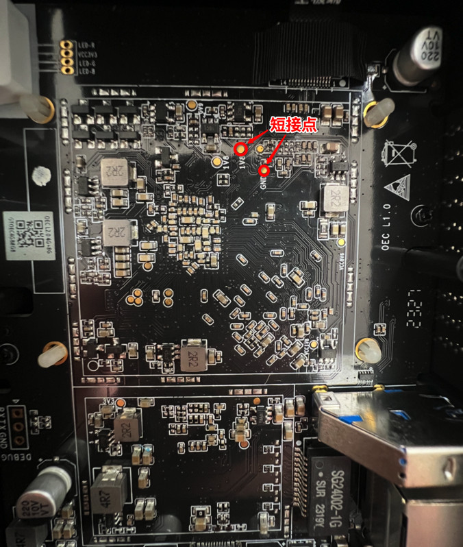
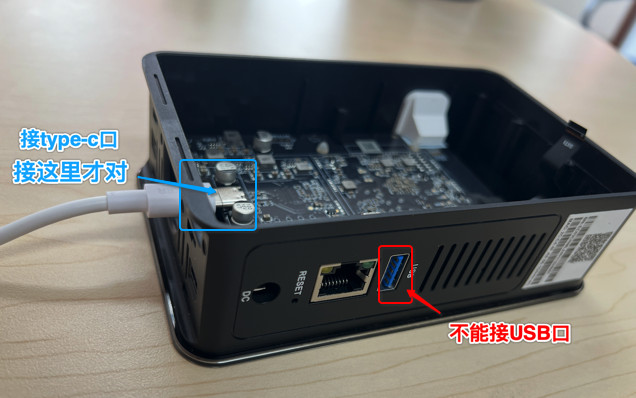
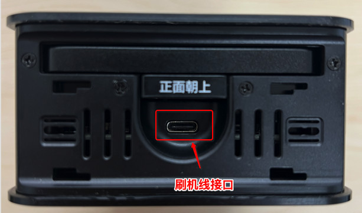
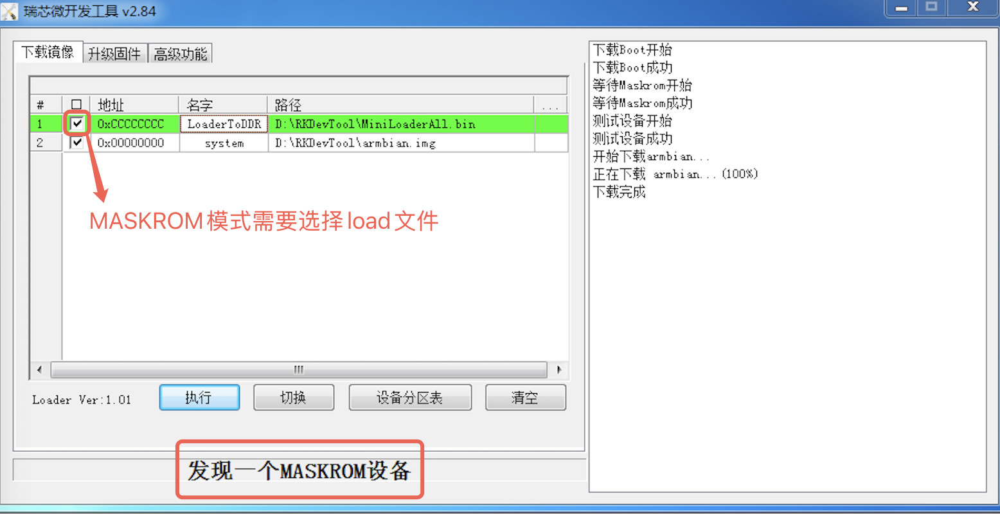
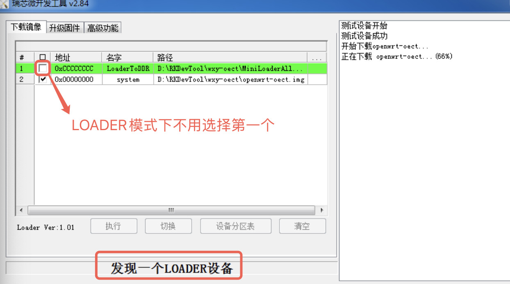
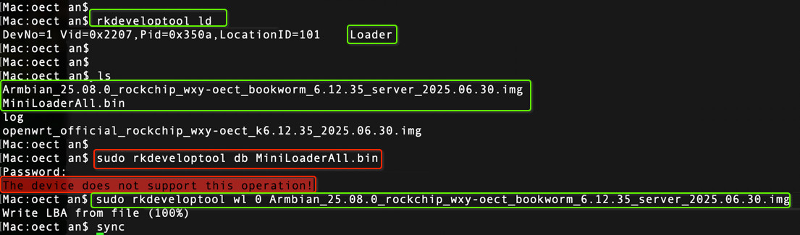
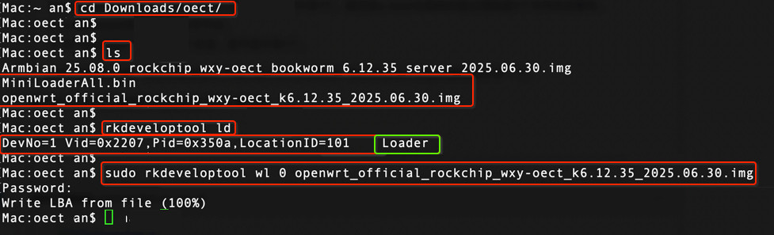
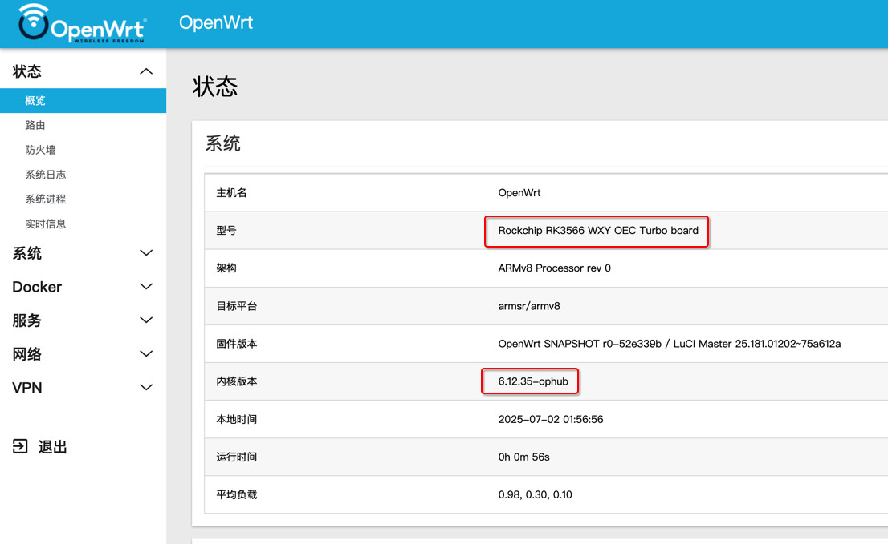
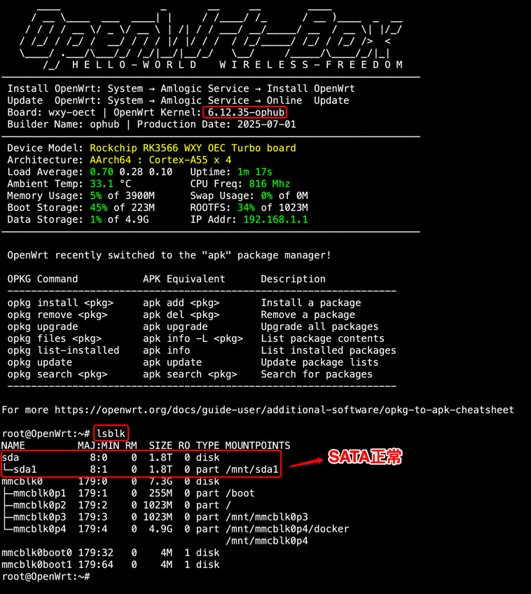

# OEC-turbo 刷机参考

以下内容整理自 [ophub/amlogic-s9xxx-armbian#2736](https://github.com/ophub/amlogic-s9xxx-armbian/pull/2736) 相关讨论和 ophub OEC-turbo 资料。刷机有风险，请提前准备救砖工具并确认硬件版本。

## 准备文件

- 刷机工具：[RkDevTool_v2.84__DriverAssitant_v5.12.tar.xz](https://github.com/ophub/kernel/releases/download/tools/RkDevTool_v2.84__DriverAssitant_v5.12.tar.xz)
- Loader 文件：
  - [MiniLoaderAll.bin](https://github.com/ophub/u-boot/blob/main/u-boot/rockchip/wxy-oect/MiniLoaderAll.bin)
  - [rk356x-MiniLoaderAll.bin](https://github.com/ophub/u-boot/blob/main/u-boot/rockchip/wxy-oect/rk356x-MiniLoaderAll.bin)
- Type-C 数据线、短接用镊子或金属针、按 `RESET` 孔用的卡针。
- 拆机视频：[Bilibili BV1vdVzzsErB](https://www.bilibili.com/video/BV1vdVzzsErB/)
- 拆机图文：[CSDN 文章](https://blog.csdn.net/John_Lenon/article/details/146461220)

## 进入刷机模式

刷机前先确认设备断电，并且不要接外置电源。刷机过程由 Type-C 数据线供电即可。

Type-C 数据线要接盒子的 Type-C 刷机口，不是旁边的普通 USB 口。建议使用能传数据的 Type-C 线，充电线可能无法被电脑识别。







### 第一次从原厂系统刷入

首次从原厂系统刷入第三方系统时，通常需要短接进入 `MaskROM` 模式。

1. 拆开外壳，找到上图标出的两个短接点。
2. 确认设备断电，不接外置电源。
3. 用镊子或金属针短接这两个点，并保持不要松开。
4. 在保持短接的同时，把 Type-C 数据线插入盒子的 Type-C 刷机口，另一端连接电脑。
5. 电脑识别到新设备后再松开短接点，RKDevTool 通常会显示 `MaskROM`。

如果电脑没有识别设备，先拔掉 Type-C，确认短接点接触稳定后再重复一次。

### 后续再次刷机

已经刷过 Armbian/OpenWrt 后，再次刷机通常不需要拆机短接，可以通过 `RESET` 孔进入刷机模式。

1. 设备保持断电，不接外置电源。
2. 用卡针按住 `RESET` 孔，不要松开。
3. 保持按住 `RESET`，把 Type-C 数据线插入盒子的 Type-C 刷机口，另一端连接电脑。
4. 电脑识别到设备后松开 `RESET`，RKDevTool 通常会显示 `Loader`。

如果 `RESET` 方式无法进入刷机模式，可以按“第一次从原厂系统刷入”的短接方式进入 `MaskROM` 后再刷。

### 模式区别

- `MaskROM`：常见于第一次刷机或救砖，需要先写入 loader，再写入 img 镜像。
- `Loader`：常见于后续再次刷机，一般只需要写入 img 镜像。

## Windows 刷机

1. 安装 RKDevTool 里的驱动，打开 RKDevTool。
2. 把下载到的 `*.img.gz` 镜像先解压成 `.img`，不要直接刷 `.gz` 压缩包。
3. 按上面的说明让 OEC-turbo 进入刷机模式。
4. 查看 RKDevTool 提示当前是 `MaskROM` 还是 `Loader`。

如果是第一次刷机，通常进入 `MaskROM`，需要同时选择 loader 和 img 镜像。如果之前已经刷过 Armbian/OpenWrt，再刷通常进入 `Loader`，只选择 img 镜像即可。

RKDevTool 两行路径示例：

```text
0xCCCCCCCC  LoaderToDDR  <MiniLoaderAll.bin 文件路径>
0x00000000  system       <解压后的 .img 文件路径>
```

确认路径后执行刷写，等待 RKDevTool 提示完成再断开 Type-C。





## macOS 刷机

安装 Homebrew：

```sh
/bin/bash -c "$(curl -fsSL https://raw.githubusercontent.com/Homebrew/install/HEAD/install.sh)"
```

安装并编译 `rkdeveloptool`：

```sh
brew install automake autoconf libusb pkg-config git wget
git clone https://github.com/rockchip-linux/rkdeveloptool
cd rkdeveloptool
export CXXFLAGS="-g -O2 -Wno-error=vla-cxx-extension"
autoreconf -i
./configure
make -j $(nproc)
cp rkdeveloptool /opt/homebrew/bin/
```

按上面的说明让 OEC-turbo 进入刷机模式后，查看设备状态：

```sh
rkdeveloptool ld
```



刷写命令：

```sh
# MaskROM 模式需要先写 loader；Loader 模式可跳过这一步。
sudo rkdeveloptool db MiniLoaderAll.bin

# 写入解压后的 img 镜像。
sudo rkdeveloptool wl 0 immortalwrt.img
```

看到 `Write LBA from file (100%)` 即表示写入完成。



## MAC 地址提醒

部分 OEC-turbo 底包的 u-boot 里可能使用相同 MAC 地址，例如 `00:15:18:01:81:31`。同一局域网多台设备 MAC 相同会冲突，需要自行修改。

参考 ophub 文档第 `12.7.2.4` 节：[README.cn.md](https://github.com/ophub/amlogic-s9xxx-armbian/blob/main/documents/README.cn.md)

u-boot 环境变量修改示例：

```sh
sudo apt-get update
sudo apt-get install -y libubootenv-tool
sudo fw_setenv ethaddr 02:55:66:77:88:99
sudo fw_printenv ethaddr
```

## OpenWrt 启动截图参考




